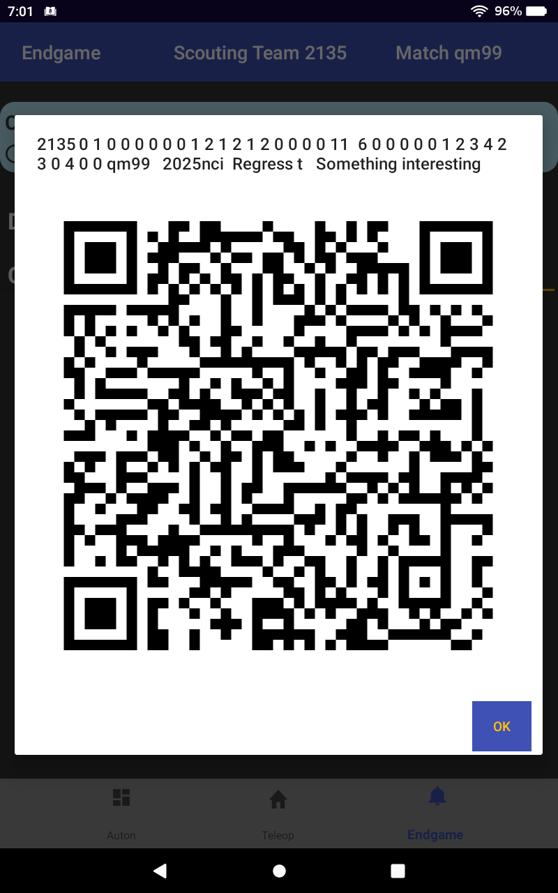

<picture>
 <source media="(prefers-color-scheme: dark)" srcset="YOUR-DARKMODE-IMAGE">
 <source media="(prefers-color-scheme: light)" srcset="YOUR-LIGHTMODE-IMAGE">
 
</picture>

# Scouting Web App (github: scouting_web)

## What does it do?

This repo is for the scouting web application. It is used to capture pit, match, and strategic data during an FRC competition. Input for pit and strategic data are collected on web forms, and the match data is collected by a QR scanner form. Robot photos are also uploaed via a web form.

Collected data can be viewed through a match data page and strategic data page. The team related data can also be viewed through a team lookup page to show scoring averages, maximums, trends. Match analyses are provided by a match sheet page that combines information from all 6 robots in a scheduled match with cumulative statistics on how the match might happen. Event related data can be also viewed through an event averages table and the COPR data from the Blue Alliance. 

## How is it structured?

Web pages are written to use Bootstrap, PHP, and javascript to gather and display the results from the main database. The scouting database is MySQL on our team web site, Web pages access the scouting database over Internet connections and also pull information from the Blue Alliance.

## Where is it stored?

This  is stored in the "scouting_web" repo on the team's github at:

https://github.com/usfirst-frc-2135/scouting_web

# Scouting App Settings

## Setting the event code for a new event:

To change the event code at the actual website scouting data: 
- Go to the https://frc2135.org/scouting/2025/ path in your browser.
- In the dbStatus page, you only need to change the event code to the one you want. (e.g. 2025cafr)
- Scroll down to the bottom of the page and click "Write Config" (no other buttons need to be clicked). This writes a file onto the server that changes the active event for everyone.

## Normal dbStatus Settings for website

The normal dbStatus settings are as shown below. They shouldn’t need to be edited to change the event code or access the picklist page:
 
- Server URL:  `localhost` (^1)
- Database Name:  `scouting2025_2`
- User Name:  `scoutingsql`
- Password:  `xxxxxxx` (ask for this) 
- tbakey:  `w3if5pkJk5JxG4OJw3wuxEShriilntI6lijMZFCAn12QkOR4ltxcJ6nPWK0Kifnu`

(^1) (because the SQL code is executing on the server and can identify itself with 'localhost')| 

### When creating a new database on the actual website:

To initially create a new database on the website, Mr. Mullins has to physically create the new database using frc2135.org/cpanel.

- Go to MySQL Databases
- Create the new database (e.g. scouting2026)
- Add the `scoutingsql` user with all privileges

Tables within the database are created automatically when the scouting web app connects to a new database.

## Scouting Web App File Locations

__Base Path__

The Java script PHP files and directories (these are the files stored for the Scouring Web App in github) are found here (this is the `<base_path>`):

On the live team website (frc2135):
- `/public_html/scouting/2025/`

For the localhost on a (Mac OS X) development computer:
- `/Applications/MAMP/htdocs/scouting_web/`

__Robot Photo Image Files__

The robot photo image files are uploaded from the __Picture Upload__ page. These files should be deleted each year for the new challenge. They are placed in this location with this naming pattern:

- `<base_path>/robot-pics/<team_number>-<image_number>.<suffix>` 

__Database and Tables Files__

When a new database and tables are created, a db config file is created:  

On the live team website (frc2135):
 - `/public_html/db_config.ini`
  
For the localhost on a (Mac OS X) development computer:
 - `/Applications/MAMP/db_config.ini`

Files that seem to hold the database/table data are also created:

On the live team website (frc2135):
 - `/public_html/../.mysql_backup/<database_name>.sql.gz`
(GZ file can be unzipped using “gzip -d <file>”)

For the localhost on a (Mac OS X) development computer:
 - `/Applications/MAMP/db/mysql57/<database_name>/<table_name>.frm` and `<table_name>.ibd`

These files can be deleted once that database or table is no longer valid or used.

__Viewing Data in Tables__

The way to look at the (local) database is by navigating to localhost/phpMyAdmin in your browser (if you can't find this, you should be able to navigate to http://localhost/MAMP/ which should have info on getting to phpMyAdmin). On the left you should see all the database names and you can click on one to show all the tables in that database. You can click on the table name and it should show you the structure and data in each table. This should show you everything you want to know about the tables.

__Debugging PHP code__

For debugging PHP code, use this command to print out a message to the error log file:

`error_log(“<msg_text>”);`

Where <msg_text> can be appended with variable $var in this way: 

         `error_log(“---> this is the data: $var”);`

The issued message will be found near the bottom of the error log file, here:

On the live team website (frc2135):
- `/public_html/scouting/2025/error_log`

For the localhost on a (Mac OS X) development computer:
- `/Applications/MAMP/logs/php_error.log`
